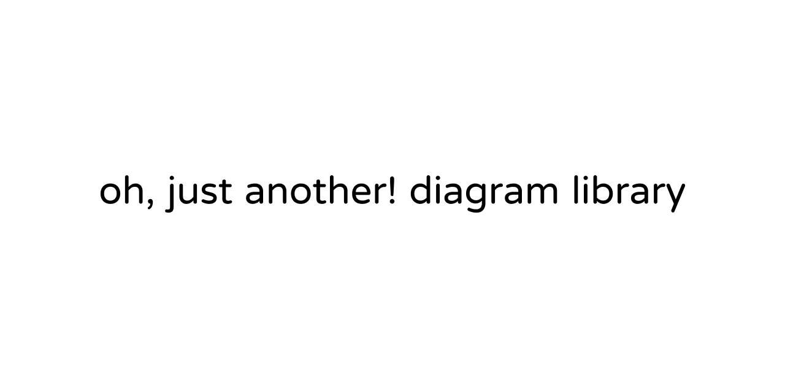

<div alt style="text-align: center;">
	<picture>
		<source media="(prefers-color-scheme: dark)" srcset="./assets/github-hero-dark.png" />
		
	</picture>
</div>

> [!WARNING]
> Pre-1.0 and under active development — APIs may change.

<!-- Badges track the drop-in package, @oh-just-another/editor. -->

[](https://www.npmjs.com/package/@oh-just-another/editor)
[](https://github.com/oh-just-another/diagram/actions/workflows/ci.yml)
[](https://www.npmjs.com/package/@oh-just-another/editor)
[](./LICENSE)
[](https://github.com/oh-just-another/diagram#readme)

A drop-in **infinite-canvas diagram editor for React** — and renderable headless on the server with CLI-tool.

**[Documentation](https://ohjustanother.site)** ·
**[Live demo](https://ohjustanother.site)** ·
**[Contributing](./CONTRIBUTING.md)**

## Features

- **Drop-in** — one `<Editor>` component. Add the package, render, ship.
- **Multi-renderer** — WebGL2 / Canvas2D / OffscreenCanvas.
- **Headless render** — turn a scene into PNG or SVG in Node, no DOM — for servers, thumbnails, and exports.
- **Import** — Mermaid, Graphviz, and drawio diagrams.
- **Persistence & history** — versioned serialization with migrations, transactional undo/redo, and snapshot /
  branch / diff history.
- **MIT** — free for any project, commercial included; no production gate, no forced watermark.

## Use in your app

```bash
pnpm add @oh-just-another/editor react react-dom
```

```tsx
import {Editor} from "@oh-just-another/editor";
import "@oh-just-another/react-ui/styles.css";

export default function Diagram() {
  return <Editor style={{position: "fixed", inset: 0}}/>;
}
```

Full guides and a live, in-browser editor: **<https://ohjustanother.site>**.

## Architecture

The library ships as independent npm packages under the `@oh-just-another/*` scope with one-way dependencies (L0 → L6) —
use the drop-in `editor`, or compose the lower layers directly.

## Contributing

Contributions are welcome — see [CONTRIBUTING.md](./CONTRIBUTING.md) and the
[Code of Conduct](./CODE_OF_CONDUCT.md). For vulnerabilities, follow the
[Security Policy](./SECURITY.md).

## License

[MIT](./LICENSE) — free for any use, including commercial.
