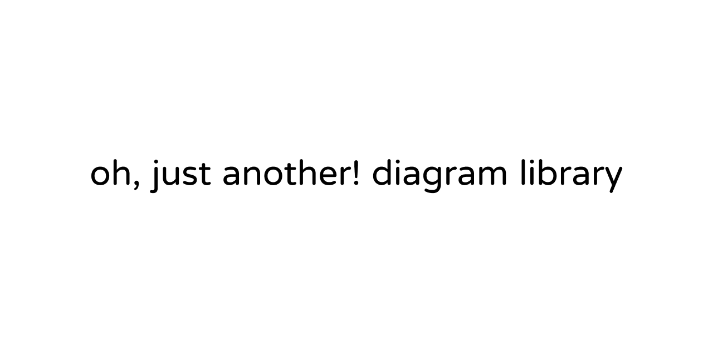

<div alt style="text-align: center;">
	<picture>
		<source media="(prefers-color-scheme: dark)" srcset="./assets/github-hero-dark.png" />
		
	</picture>
</div>

> [!WARNING]
> Pre-1.0 and under active development — APIs may change.

<!-- Badges track the drop-in package, @oh-just-another/editor. -->

[](https://www.npmjs.com/package/@oh-just-another/editor)
[](https://github.com/oh-just-another/diagram/actions/workflows/ci.yml)
[](https://www.npmjs.com/package/@oh-just-another/editor)
[](./LICENSE)
[](https://github.com/oh-just-another/diagram#readme)

A drop-in **infinite-canvas diagram editor for React** — and renderable headless on the server with CLI-tool.

**[Documentation](https://ohjustanother.site)** ·
**[Live demo](https://ohjustanother.site)** ·
**[Contributing](./CONTRIBUTING.md)**

## Highlights

- **MIT, free for everyone — pledged.** No license keys, no watermarks, no
  production gate, commercial use included. See the
  [license pledge](./.github/GOVERNANCE.md).
- **Fast canvas** — auto-detected WebGL2 / OffscreenCanvas / Canvas2D renderer
  with MSDF text and WASM text shaping.
- **Headless server rendering** — render scenes to SVG / PNG / PDF in Node
  without a browser (`@oh-just-another/headless`, CLI included).
- **Real-time collaboration** — CRDT sync (Yjs) with presence cursors and
  optional end-to-end encryption; self-hostable relay.
- **Version history** — snapshots, branches, scene diff, and three-way merge.
- **Comments** — pinned annotation threads with mentions.
- **Framework-friendly** — React drop-in, a dependency-free
  `<oja-diagram>` custom element, and Vue / Svelte wrappers.
- **Extensible** — registry-based custom shapes, renderers, templates,
  importers (Mermaid / Graphviz / draw.io), and layouts.

## Use in your app

```bash
pnpm add @oh-just-another/editor react react-dom
```

```tsx
import { Editor } from "@oh-just-another/editor";
import "@oh-just-another/react-ui/styles.css";

export default function Diagram() {
  return <Editor style={{ position: "fixed", inset: 0 }} />;
}
```

Full guides and a live, in-browser editor: **<https://ohjustanother.site>**.

## Architecture

The library ships as independent npm packages under the `@oh-just-another/*` scope with one-way dependencies (L0 → L6) —
use the drop-in `editor`, or compose the lower layers directly.

## Contributing

Contributions are welcome — see [CONTRIBUTING.md](./CONTRIBUTING.md) and the
[Code of Conduct](./CODE_OF_CONDUCT.md). For vulnerabilities, follow the
[Security Policy](./SECURITY.md).

## License

[MIT](./LICENSE) — free for any use, including commercial.
